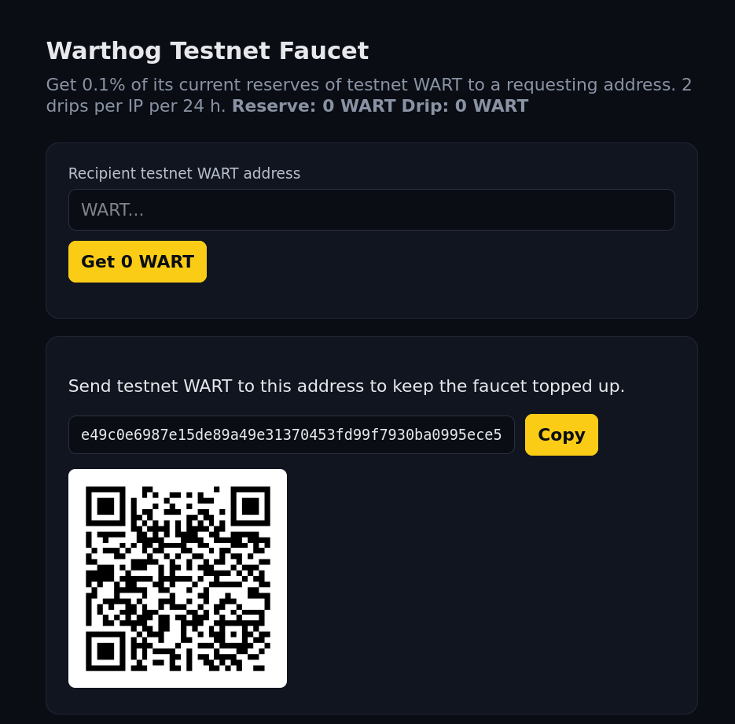

# testnet-faucet

Self-hosted Node service that drips **0.1% of its current reserves** of
testnet WART to a requesting address, with a per-IP rate limit of
**2 payments per rolling 24 hours**. Used by the website's `/testnet`
page.

The faucet's WART address is **derived at boot from `FAUCET_HEX_PRIVKEY`**
via `warthog-js`. It is never hard-coded in any file.

> Network: defi testnet only — the faucet keypair lives on testnet, not
> mainnet.



## Highlights

- Single Node process, single testnet instance.
- `0.1%` of self-balance per drip, transaction fee out of that 0.1%.
- Per-IP rate limit, `X-Forwarded-For` aware (configurable `TRUST_PROXY`).
- In-RAM balance cache polled from a public defi testnet node, no persistent
  storage.
- Drip returns a `txId` and an `explorerUrl` the website can link to.

## API

| Route | Description |
|---|---|
| `GET /` | Landing page: address form, "Request 0.1%" button, copyable donation row with QR. Single line: *"Send testnet WART to this address to keep the faucet topped up."* |
| `POST /api/drip` | Body `{ "address": "WART..." }`. Returns `{ ok, txId, amount, reserveBefore, reserveAfter, explorerUrl }` or an error (400 invalid address, 429 rate limited with `retryAfterSeconds`, 503 node unreachable / drip too small / no node reachable, 500 broadcast failure). |
| `GET /api/status` | Returns `{ faucetAddress, reserve, node, lastBalanceCheckAt, dripPercent, dripsLast24h, health: { up, uptimeSec, nodeReachable } }`. The `health` sub-shape reports process liveness and node reachability so monitoring tools don't need a separate endpoint. |

CORS allowlist: `https://warthog.network` (production) + `http://localhost:4321` (dev).

## Run locally

You need Node.js 20 or newer.

```sh
git clone https://github.com/warthog-network/testnet-faucet
cd testnet-faucet
npm install
npm run gen-key       # prints FAUCET_HEX_PRIVKEY=<hex> and a comment with the derived address
```

The `gen-key` output puts only the priv key in env-var form. The address is shown as a comment because it's derived at boot from the priv key — never an env var.

```sh
# Create your local env (testnet instance)
cat > .env <<EOF
FAUCET_HEX_PRIVKEY=<paste the hex from gen-key>
NODE_URL=https://warthog-defitestnet.duckdns.org/
PORT=3001
TRUST_PROXY=loopback
EOF
```

Run it:

```sh
npm run dev
# server is now listening on http://localhost:3001
# (PORT defaults to 3001 for `npm run dev` to avoid EADDRINUSE;
#  override with `PORT=4000 npm run dev`)
# open http://localhost:3001 in a browser to use the landing page
```

The landing page on `http://localhost:3000` shows the faucet's address (derived from your `FAUCET_HEX_PRIVKEY`) and a QR code. Send some testnet WART to that address, then click "Request 0.1%" with any testnet WART address in the recipient field. The result row shows the `txId` and a link to the testnet explorer.

## Run in production (one host, one process)

The production posture is one host running the Node service directly, with the host's nginx as a reverse proxy.

```sh
# On the host
sudo useradd --system --shell /usr/sbin/nologin --home /opt/testnet-faucet testnet-faucet
sudo install -d -o testnet-faucet -g testnet-faucet /opt/testnet-faucet
sudo -u testnet-faucet git clone https://github.com/warthog-network/testnet-faucet /opt/testnet-faucet
cd /opt/testnet-faucet
sudo -u testnet-faucet npm ci --omit=dev
```

Place the env file at `/opt/testnet-faucet/testnet-faucet.env` (root-only, mode 0600). A systemd unit:

```ini
# /etc/systemd/system/testnet-faucet.service
[Unit]
Description=Warthog testnet faucet
After=network.target

[Service]
Type=simple
WorkingDirectory=/opt/testnet-faucet
EnvironmentFile=/opt/testnet-faucet/testnet-faucet.env
ExecStart=/usr/bin/env node src/server.js
Restart=on-failure
RestartSec=5
User=testnet-faucet

[Install]
WantedBy=multi-user.target
```

```sh
sudo systemctl daemon-reload
sudo systemctl enable --now testnet-faucet
```

## Reverse proxy (nginx)

The faucet's IP detection requires nginx to **rewrite** `X-Forwarded-For`
from the immediate peer, not pass through a client-supplied header. A safe
nginx server block for `faucet.testnet.warthog.network`:

```nginx
server {
  listen 443 ssl http2;
  server_name faucet.testnet.warthog.network;

  ssl_certificate     /etc/letsencrypt/live/faucet.testnet.warthog.network/fullchain.pem;
  ssl_certificate_key /etc/letsencrypt/live/faucet.testnet.warthog.network/privkey.pem;

  real_ip_header X-Forwarded-For;
  set_real_ip_from 127.0.0.1;

  location / {
    proxy_pass http://127.0.0.1:3000;
    proxy_set_header Host              $host;
    proxy_set_header X-Real-IP         $remote_addr;
    proxy_set_header X-Forwarded-For   $remote_addr;
    proxy_set_header X-Forwarded-Proto $scheme;
    proxy_http_version 1.1;
  }
}

server {
  listen 80;
  server_name faucet.testnet.warthog.network;
  return 301 https://$host$request_uri;
}
```

## Configuration

All configuration is via environment variables. No persistent storage.

| Var | Default | Notes |
|---|---|---|
| `FAUCET_HEX_PRIVKEY` | required | 64-char hex (32-byte secp256k1). The faucet's address is derived from this at boot. |
| `NETWORK` | `testnet` | Fixed for this repo. |
| `NODE_URL` | (see below) | Public defi testnet node. **In development** (`npm run dev`), a default is used (`https://warthog-defitestnet.duckdns.org/`) so the dev path works out-of-the-box. **In production**, `NODE_URL` is required and a missing value fails fast at boot. |
| `PORT` | `3000` | |
| `DRIP_PERCENT` | `0.1` | Percent of self-balance per drip. |
| `TX_FEE` | `0.001` | Network fee the faucet pays on every drip. Comes out of the 0.1%. |
| `RATE_LIMIT` | `2` | Payments per IP per rolling window. |
| `WINDOW_HOURS` | `24` | Rate-limit window. |
| `BALANCE_POLL_MS` | `60000` | How often to poll the node for the faucet's own balance. |
| `TRUST_PROXY` | `loopback` | `false` / `loopback` / `<CIDR>` / `true`. See [docs/deploy.md](docs/deploy.md) for the full matrix. |
| `CORS_ORIGIN` | (see below) | Comma-separated allowlist. **In development** the default includes `https://warthog.network`, `http://localhost:3000`, `http://localhost:4321`, `http://127.0.0.1:3000`, `http://127.0.0.1:4321`. **In production** the operator should set this to only the website's origin (e.g. `https://warthog.network`). |

If `floor( selfBalance * 0.001 - fee )` is ≤ 0, the drip is refused with
`503 { ok: false, error: "drip too small" }`.

The first balance poll completes before the server accepts connections,
so a misconfigured `NODE_URL` or unreachable testnet node surfaces as a
clear startup error rather than a misleading landing page.

## License

MIT.

## Maintainer

Warthog team — [Discord](https://discord.com/invite/QMDV8bGTdQ).
